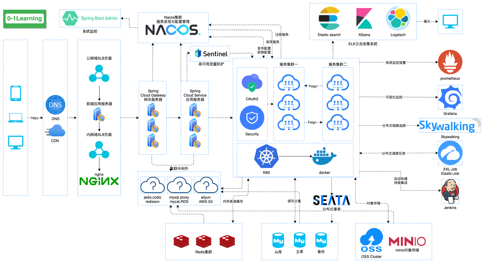
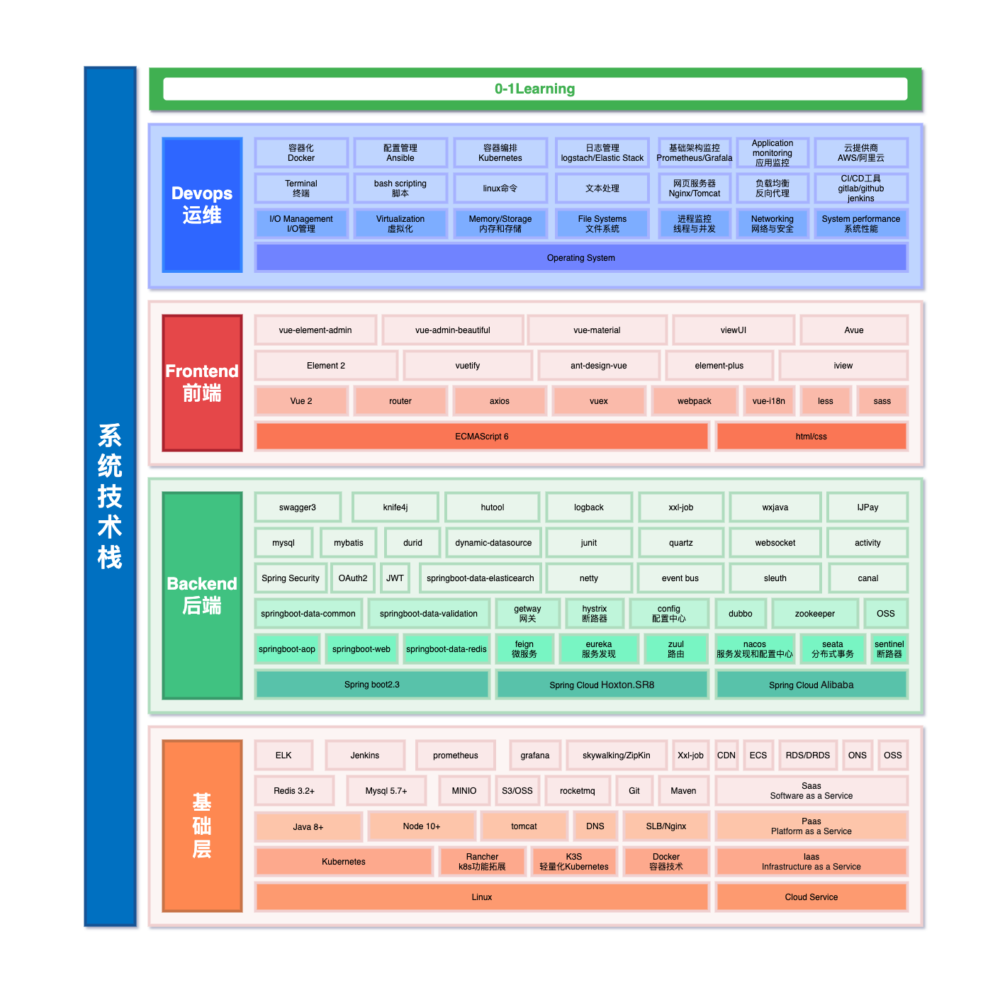
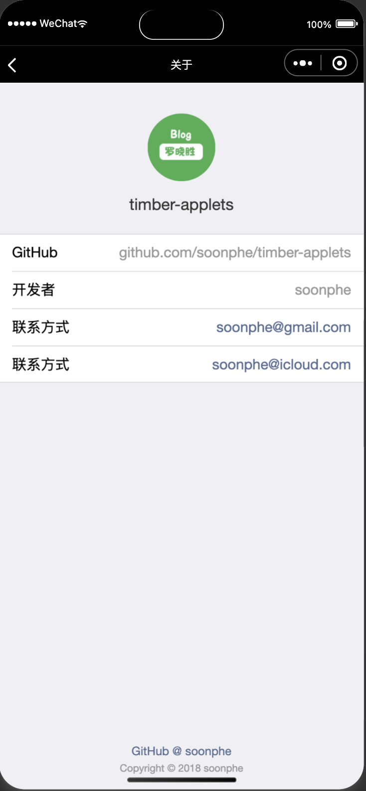

# timber-applets

## 项目介绍（Project Introduction）

项目取名timber——`木材`，寓意人类从刀耕火种逐渐进化的源头，星星之火，可以燎原，愿这个项目也可以成为开发者入门的源头。

这是一个实现`0-1Learning`这个项目所有的知识点的实现项目，包括的Java backend(后端)，web frontend(前端)，Android App，ios App、小程序等一整套的项目合集，可以让你一次性接触到任何一端的项目开发流程是怎么样的（yes,so cool）

你可以选择从`0-1`实现任何一端开始学习项目开发，也可以先写好后端服务及接口、再写前端、和App等项目。

任何一端的项目都可以拷贝到本地直接运行，构建你自己的本地服务。

如果想搞懂更多的项目知识体系，更多项目所有技术文档都在 [0-1Learning](http://github.com/soonphe/0-1Learning) 中有完整介绍，欢迎前往阅读。

### 设备支持（Equipment support）

设备支持：`java`,`web`、`android`、`ios`、`小程序`

### 项目地址（Project Address）

- java backend：[timber](http://github.com/soonphe/timber)
- web frontend：[timber-web](http://github.com/soonphe/timber-web)
- android APP：[timber-android](http://github.com/soonphe/timber-android)
- ios App：[timber-ios](http://github.com/soonphe/timber-ios)
- 小程序：[timber-applets](http://github.com/soonphe/timber-applets)

### 业务支持（Business Support）

- 版本管理：版本管理，版本下发，设备更新
- 广告业务：支持广告智能投放，自动上架与下架，广告覆盖有效统计
- 用户业务：用户侧业务支持
- 电影业务：对接xx电影网，本地上传电影
- 视频业务：小视频点播
- 书吧小说：文件上传和爬虫抓取
- 音乐业务：音乐发布、播放、下载
- 游戏业务：html游戏
- 餐饮业务：餐品发布，购买订餐，财务结算
- 城市业务：城市个性化推荐，城市介绍，衣食住行
- 新闻文章：新闻富文本排版，下发阅读，定期抓取

### 业务功能模块（functional module）

```
├── 系统模块
    ├── 用户统一管理后台系统UUM，用户、登录、
    └── 权限系统模块
├── 业务模块
    ├── 广告模块
    ├── 电影模块
    ├── 视频模块
    ├── 小说模块
    ├── 新闻模块
    ├── 游戏模块
    └── 视频模块
├── 搜索模块
├── 三方功能模块
└── 数据模块
    ├── 埋点模块
    └── 统计模块
```

### 高可用分布式系统架构（Highly available distributed system architecture）



### 系统技术栈（System Technology Stack）



### 项目展示（Project Show）



### 项目结构（Project Structure）

```
timber-applets
├── apis                  // 网络请求封装*
  ├── app.js  
  ├── ...
  └── request.js          // get/post请求封装
├── assets                // 静态文件
├── component-demos       // 组件展示
├── components            // 可复用组件*
│   ├── async-button      // 异步按钮
│   ├── async-switch      // 异步切换器
│   ├── collapse          // 可折叠容器
│   ├── load-more         // 加载更多
│   ├── no-data           // 暂无数据
│   ├── panel             // 带导航标题的面板
│   ├── popup             // 底部弹出层
│   ├── rate              // 可评半星的评分组件
│   ├── search-bar        // 带遮罩的搜索框
│   ├── send-code         // 发送验证码按钮
│   ├── spinner           // 加载中动画
│   ├── sticky            // 固定页头
│   ├── sticky-2          // 固定页头的另一种实现
│   ├── tab-bar           // 标签页
│   ├── toast             // 弹出提示
│   └── toptip            // 顶部提示
├── docs                  // 文档
├── images                // 图标
├── pages                 // 页面，子页面在父页面的children文件夹中
│   ├── ...               // 页面...
│   └─components          // 与业务相关的特殊组件
├── styles                // 样式
├── templates             // 模板
│   ├── library-list      // 图书馆列表
│   ├── page-status-indicator // 页面加载状态，带有一个“重新加载”按钮
│   └── showcase          // 图书项目
└── utils                 // 辅助模块
    ├── biz-helper.wxs    // 业务相关辅助函数，用于wxml中
    ├── constant.js       // 业务常量
    ├── constant.wxs      // 业务常量，用于wxml中
    ├── es6-promise.js    // Promise语法支持
    ├── event.js          // 全局事件
    ├── permission.js     // 登录鉴权
    ├── promise-polyfill.js // Promise.finally()语法
    ├── promisify.js      // 微信小程序API Promise化
    ├── qrcode.js         // 二维码生成
    ├── tip.js            // 使用帮助
    ├── utils.js          // 辅助函数
    ├── validator.js      // 正则校验器
    └── fundebug.js       // 错误监控
├── app.js -- app入口
├── app.json -- 全局配置
├── app.wxss -- 全局css
├── project.config.json -- 项目配置文件
├── project.private.config.json -- 项目私有配置文件。此文件中的内容将覆盖 project.config.json 中的相同字段
├── sitemap.json
└── README.md -- 说明

备注：标 * 的为重点模块
```

### 项目架构（System Architecture）

#### 1.基础项目架构（Base Framework）

- 基于微信基础库 2.25.3

#### 2.项目组件库（Project Widget Library）


#### 3.工具库（Tools Library）

### 工作进度（Work Progress）
- 网络请求，含参(已完成)
- List界面渲染（已完成）
- 真机渲染（已完成）
- 商城（已完成）
- 消息(暂缓)
- 我的（已完成）
- 注册页（注册成功，保存token和userInfo，uid=id）
- 登录页（注册即登录）
- 关于我们（灰色字体：999999，蓝色字体：576b95）
- Wx.login，调用接口获取登录凭证（code），通过凭证进而换取用户登录态信息，包括用户在当前小程序的唯一标识（openid）、微信开放平台账号下的唯一标识（unionid，若当前小程序已绑定到微信开放平台账号）及本次登录的会话密钥（session_key）等。用户数据的加解密通讯需要依赖会话密钥完成
* wx.getUserInfo，获取用户信息
    * res.userInfo为不包含openId等敏感信息
    * userInfo	UserInfo	用户信息对象，不包含 openid 等敏感信息	
    * rawData	string	不包括敏感信息的原始数据字符串，用于计算签名	
    * signature	string	使用 sha1( rawData + sessionkey ) 得到字符串，用于校验用户信息，详见 用户数据的签名验证和加解密	
    * encryptedData	string	包括敏感数据在内的完整用户信息的加密数据，详见 用户数据的签名验证和加解密	
    * iv	string	加密算法的初始向量，详见 用户数据的签名验证和加解密	
    * cloudID	string	敏感数据对应的云 ID，开通云开发的小程序才会返回，可通过云调用直接获取开放数据，详细见云调用直接获取开放数据
* wx.authorize(Object object) 微信授权
* wx.authorizeForMiniProgram(Object object)，仅小程序插件中能调用该接口，用法同 wx.authorize
* wx.getSetting  // 查看是否授权，获取用户的当前设置。返回值中只会出现小程序已经向用户请求过的权限。
* 手机号快速验证组件
* 手机号实时验证组件
- 轮播图swiper（已完成）——调整为静态文件+url共存
- cardView（已完成）
- 本地存储：get/setStorageSync（已完成）
- we.for警告解决(不添加wx:id会自动警告，如不提供 wx:key，会报一个 warning， 如果明确知道该列表是静态，或者不必关注其顺序，可以选择忽略)
- 报错解决（export function变为module.exports中包含）

## 在哪里可以免费看我的文章

### github
>  [0-1Learning](https://github.com/soonphe/0-1Learning "")
> 

 ### 公众号

公众号已发布 `0-1Learning` 部分文章，另有更多好文，等待你的探索，关注公众号「**罗晓胜**」第一时间获取。


### 在哪里可以免费看我的视频

文字终究表达有限，视频效果会比文字好很多。

**视频内容想到哪就拍到哪了，什么好玩就拍什么了，也不想给自己规定个什么内容了，以后的事，谁说得准呢！**

尽量会在全平台投稿，Youtube、tiktok、B站等，关注「**罗晓胜**」第一时间获取。

如有任何疑问给我留言吧，能力范围内都会回复！记得互动支持喔！

> `注意，作者不会主动联系任何人`，**任何冒充作者主动联系你都是骗子！！！**
> 
> `注意，涉及金钱交易的，请核实再核实后操作，以免上当受骗`
>
> `注意，免责申明 1、本软件产品为免费软件仅供学习交流使用，用户可以非商业性地下载、安装、复制和散发本软件产品。 2、本软件不得用于从事任何违反国家法律的事情，使用者所做任何事情也与作者无关，对于用户擅自使用本软件从事违法活动不承担任何责任`

## 许可证

Copyright (c) 2018 soonphe
